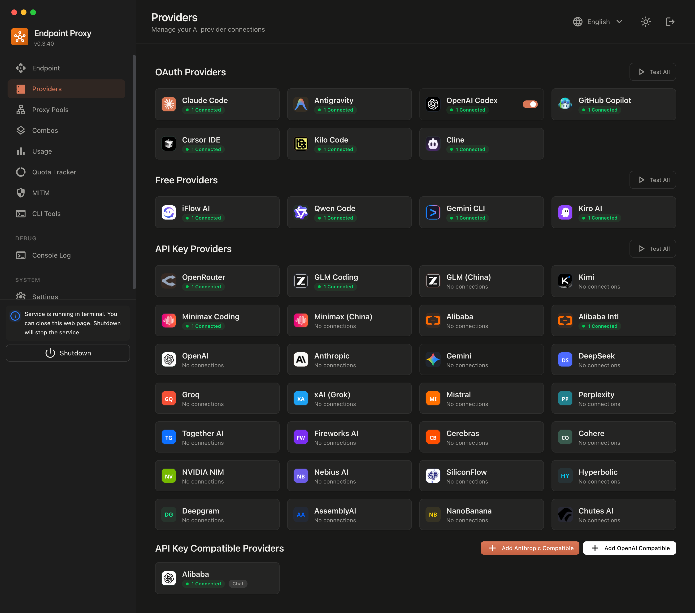

<div align="center">



# ⚡ XyzRouter

**Route every AI coding tool to 40+ providers and 100+ models — with smart failover, format translation and RTK token savings.**

Claude Code · Codex · Cursor · Copilot · Cline · OpenCode · Gemini CLI · Antigravity ... → **one endpoint**

[](CHANGELOG.md)
[](https://nodejs.org)
[](LICENSE)
[](https://hub.docker.com/r/xyz/xyzrouter)
[](https://www.npmjs.com/package/xyzrouter)
[](https://www.npmjs.com/package/xyzrouter)
[](https://github.com/iloveforduck/xyzrouter/commits/master)

**Read me in your language:**

🇺🇸 **English** · 🇨🇳 [简体中文](#-readme-%E7%AE%80%E4%BD%93%E4%B8%AD%E6%96%87) · 🇷🇺 [Русский](#-readme-%D1%80%D1%83%D1%81%D1%81%D0%BA%D0%B8%D0%B9) · 🇩🇪 [Deutsch](#-readme-deutsch) · 🇫🇷 [Français](#-readme-fran%C3%A7ais) · 🇪🇸 [Español](#-readme-espa%C3%B1ol) · 🇸🇦 [العربية](#-readme-%D8%A7%D9%84%D8%B9%D8%B1%D8%A8%D9%8A%D8%A9) · 🇮🇷 [فارسی](#-readme-%D9%81%D8%A7%D8%B1%D8%B3%DB%8C) · 🇻🇳 [Tiếng Việt](#-readme-ti%E1%BA%BFng-vi%E1%BB%87t) · 🇯🇵 [日本語](#-readme-%E6%97%A5%E6%9C%AC%E8%AA%9E)

*Full multilingual docs:* [English](gitbook/content/en/) · [中文](gitbook/content/zh-CN/) · [Español](gitbook/content/es/) · [Tiếng Việt](gitbook/content/vi/) · [日本語](gitbook/content/ja/)

[](https://github.com/iloveforduck/xyzrouter/stargazers)
[](https://github.com/iloveforduck/xyzrouter/network/members)
[](https://github.com/topics/xyzrouter)
[](https://github.com/topics/ai)
[](https://github.com/topics/llm)
[](https://github.com/topics/claude-code)
[](https://github.com/topics/openai-compatible)
[](https://github.com/topics/self-hosted)

</div>

---

<!-- TOC -->
## 📑 Table of Contents

- [🤔 Why XyzRouter?](#-why-xyzrouter)
- [🔄 How It Works](#-how-it-works)
- [✨ Key Features](#-key-features)
- [🌐 Providers](#-providers)
- [🛠️ Supported CLI Tools](#-supported-cli-tools)
- [⚡ Quick Start](#-quick-start)
- [💸 ROI](#-roi--do-the-math)
- [🎯 Use Cases](#-use-cases)
- [🧑‍💻 CLI Reference](#-cli-reference)
- [📖 Setup Guides](#-setup-guides)
- [🔧 Configuration](#-configuration)
- [📊 API Reference](#-api-reference)
- [🧩 Agent Skills](#-agent-skills)
- [📦 Publishing to npm](#-publishing-to-npm)
- [🧪 Tech Stack](#-tech-stack)
- [🗺️ Roadmap](#-roadmap)
- [🤝 Contributing](#-contributing)
- [📮 Community & Support](#-community--support)
- [🌍 Multilingual README](#-readme---multilingual) *(中文 · RU · DE · FR · ES · AR · FA · VI · 日本語)*

---

## 🤔 Why XyzRouter?

You pay for a Claude Pro subscription… then hit the rate limit mid-session. Your GLM credits expire. Your API budget melts. Sound familiar?

**XyzRouter puts an end to all of that:**

| 😩 Without XyzRouter | 😎 With XyzRouter |
|---|---|
| Locked into one provider & one quota | Auto-failover across **40+ providers** |
| Pay-per-token even when you have unused subscriptions | Use your **subscriptions first**, cheap APIs as backup |
| Each CLI tool needs its own config & keys | **One OpenAI-compatible endpoint** for every tool |
| Claude ↔ OpenAI formats don't mix | **Real-time format translation** between them |
| Long context = 💸 burning tokens | **RTK Token Saver** compresses prompts automatically |

### The numbers

<table>
<tr>
<td align="center"><b>40+</b><br/>Providers</td>
<td align="center"><b>100+</b><br/>Models</td>
<td align="center"><b>3</b><br/>Routing tiers</td>
<td align="center"><b>~70%</b><br/>Avg. token savings</td>
<td align="center"><b>$0</b><br/>Free-tier option</td>
<td align="center"><b>2 min</b><br/>To first request</td>
</tr>
</table>

> 💬 *"It's like having a load balancer for my entire AI stack — except it also makes my bills smaller."*

> 💬 *"Set up the free-tier chain once, and my hobby projects literally cost nothing to run anymore."*

**Privacy bonus:** everything runs on **your** machine or **your** VPS. No middleman reads your prompts, no third-party proxy sits between you and your models. Self-hosted by design. 🔒

## 🔄 How It Works

```
┌─────────────┐      ┌──────────────────────────────────────┐
│  Your CLI   │      │             XyzRouter                │
│ Claude Code │─────▶│  • OpenAI-compatible API (:20128/v1) │
│ Codex       │      │  • Format translation (OpenAI↔Claude)│
│ Cursor      │      │  • Smart 3-tier routing              │
│ Cline       │◀─────│  • RTK token compression             │
│ ...         │      │  • Real-time quota tracking          │
└─────────────┘      └───────────────┬──────────────────────┘
                                     │
                    ┌────────────────┼─────────────────┐
                    ▼                ▼                 ▼
            [Tier 1: Subs]   [Tier 2: Cheap APIs]  [Tier 3: Free]
            Claude Code,     GLM ($0.6/1M),        Kiro AI,
            Codex, Copilot   MiniMax ($0.2/1M)     OpenCode Free,
                                                   Vertex AI credits
```

When one provider is rate-limited or down, XyzRouter **switches transparently** — your CLI never notices.

## ✨ Key Features

- 🎯 **Smart 3-Tier Failover** — subscriptions → low-cost APIs → free tiers, in priority order you control
- 🔀 **Format Translation** — OpenAI ↔ Claude ↔ Gemini payloads converted on the fly
- 💰 **RTK Token Saver** — compresses system prompts & context; cuts token usage dramatically
- 📊 **Live Quota Tracking** — see remaining credits/tokens per provider in the dashboard
- 👥 **Multi-Account Rotation** — pool multiple accounts per provider with auto token refresh
- 🧩 **Custom Combos** — build model chains like `kr/claude-sonnet-4.5 → glm/glm-5 → mm/M2.7`
- 📝 **Request Logs** — full visibility into every routed request/response
- ☁️ **Cloud Sync** — sync config & credentials across machines
- 🌍 **Deploy Anywhere** — localhost, VPS, Docker, or serverless platforms

## 🌐 Providers

**🔐 OAuth (subscription-based):** Claude Code · Antigravity · Codex · GitHub Copilot · Cursor

**🆓 Free tiers:** Kiro AI *(Claude 4.5 + GLM-5 + MiniMax, ~50 credits/mo)* · OpenCode Free *(no auth needed)* · Vertex AI *($300 new-account credit)*

**🔑 API-key providers (40+):** Anthropic · OpenAI · Google Gemini · DeepSeek · Moonshot Kimi · Zhipu GLM · MiniMax · Mistral · Groq · Together · Fireworks · Cerebras · Cohere · xAI · Perplexity · NVIDIA · SiliconFlow · OpenRouter · and more…

## 🛠️ Supported CLI Tools

Claude Code · OpenAI Codex CLI · GitHub Copilot · Cursor IDE · Cline · Continue · RooCode · OpenCode · OpenClaw · Aider · and any tool that speaks the OpenAI API

## ⚡ Quick Start

**1. Install & run:**

```bash
npm install -g xyzrouter
xyzrouter
```

🎉 Dashboard opens at `http://localhost:20128`

**2. Connect a free provider (no signup required):**

Dashboard → Providers → connect **Kiro AI** or **OpenCode Free** → done!

**3. Point your CLI tools at it:**

```
Endpoint: http://localhost:20128/v1
API Key:  [copy from the dashboard]
Model:    kr/claude-sonnet-4.5
```

**Alternative — run from source (this repo):**

```bash
cp .env.example .env
npm install
PORT=20128 NEXT_PUBLIC_BASE_URL=http://localhost:20128 npm run dev
```

Production:

```bash
npm run build
PORT=20128 HOSTNAME=0.0.0.0 npm run start
```

**Docker:**

```bash
docker run -d \
  -p 20128:20128 \
  -v "$HOME/.xyzrouter:/app/data" \
  --name xyzrouter \
  xyz/xyzrouter:latest
```

Also available on **GHCR**: `ghcr.io/xyz/xyzrouter` (multi-platform, amd64/arm64).

Default URLs:
- Dashboard: `http://localhost:20128/dashboard`
- OpenAI-compatible API: `http://localhost:20128/v1`

## 🧑‍💻 CLI Reference

The `xyzrouter` binary ships with the npm package:

```bash
xyzrouter                    # Start server + open dashboard
xyzrouter --port 8080        # Custom port (alias: -p)
xyzrouter --no-browser       # Don't auto-open the browser
xyzrouter --skip-update      # Skip the auto-update check
xyzrouter --help             # All options

# Point local CLI tools at a remote XyzRouter (no local server started):
npx xyzrouter connect http://<server-host>:20128 --tools claude,codex
npx xyzrouter connect --reset --tools claude     # undo

# Inspect what each tool on this machine is currently configured to:
npx xyzrouter show                 # every supported tool
npx xyzrouter show claude --json   # machine-readable
```

Supported tools for `connect`: `claude`, `codex`, `opencode`, `droid`, `crush`, `kilo`, `cline`, `pi`, `omp`, or `all`. Original configs are backed up once as `*.bak-xyzrouter`. Password can be passed via `--password` or `XYZROUTER_PASSWORD`.

Full details: [`cli/README.md`](cli/README.md)

## 💸 ROI — Do the math

XyzRouter typically **pays for itself in the first week**:

| Scenario | Typical monthly cost without XyzRouter | With XyzRouter | Savings |
|---|---|---|---|
| Claude Pro + overflow API calls | ~$60–$200 | **$20** (subscription fully utilized) | up to **90%** |
| Heavy multi-model dev (GPT + Claude + Gemini APIs) | ~$150+ | **$10–$30** (GLM/MiniMax fallbacks) | up to **85%** |
| Hobbyist / student | $30+ | **$0** (free-tier chain) | **100%** |

Plus RTK compression cuts raw token usage on every single request — the router doesn't just route, it **shrinks** what you're billed for.

## 🎯 Use Cases

**"I have a Claude Pro subscription"** → Route everything through your sub (tier 1); GLM/MiniMax kick in automatically when you hit limits. Zero extra cost.

**"I want $0 forever"** → Chain only free providers (Kiro + OpenCode Free + Vertex credits). Fully working AI coding stack for nothing.

**"I code 24/7 and can't afford downtime"** → Multi-account rotation + instant failover = your tools never stop.

**"My whole team shares one AI budget"** → One self-hosted XyzRouter instance, one endpoint, per-tool configs converge; quotas tracked centrally in the dashboard.

**"I'm experimenting with models"** → Swap `kr/claude-sonnet-4.5` → `glm/glm-5` → `mm/M2.7` with a single string change — no re-auth, no config churn.

## 📖 Setup Guides

Detailed per-tool guides live in [`docs/`](docs/) and the [GitBook](gitbook/). Quick reference:

| Tool | Endpoint | Model example |
|---|---|---|
| Claude Code | `http://localhost:20128` (ANTHROPIC_BASE_URL) | `kr/claude-sonnet-4.5` |
| Codex CLI | `http://localhost:20128/v1` | `cx/gpt-5` |
| Cursor / Cline / Continue | `http://localhost:20128/v1` | any combo |

## 🔧 Configuration

Key environment variables (full list in [.env.example](.env.example)):

| Variable | Default | Description |
|---|---|---|
| `PORT` | `20128` | Server port |
| `DATA_DIR` | `~/.xyzrouter` | Database & credentials location |
| `JWT_SECRET` | auto-generated | Dashboard auth signing key |
| `INITIAL_PASSWORD` | `123456` | First-login password |
| `REQUIRE_API_KEY` | `false` | Enforce Bearer keys on `/v1/*` (recommended for internet-facing deploys) |
| `ENABLE_REQUEST_LOGS` | `false` | Log requests/responses under `logs/` |
| `HTTP_PROXY` / `HTTPS_PROXY` | — | Optional outbound proxy for upstream calls |
| `XYZROUTER_GOOGLE_CLIENT_ID` / `..._SECRET` | — | OAuth client credentials for Google/Antigravity flows |

## 📊 API Reference

```bash
# List available models
curl http://localhost:20128/v1/models -H "Authorization: Bearer $XYZROUTER_API_KEY"

# Chat completion (OpenAI format)
curl http://localhost:20128/v1/chat/completions \
  -H "Authorization: Bearer $XYZROUTER_API_KEY" \
  -H "Content-Type: application/json" \
  -d '{"model": "kr/claude-sonnet-4.5", "messages": [{"role":"user","content":"hi"}]}'

# Claude-format messages endpoint (auto-translated)
curl http://localhost:20128/v1/messages \
  -H "x-api-key: $XYZROUTER_API_KEY" \
  -H "anthropic-version: 2023-06-01" \
  -H "Content-Type: application/json" \
  -d '{"model": "kr/claude-sonnet-4.5", "max_tokens": 64, "messages": [{"role":"user","content":"hi"}]}'
```

| Endpoint | Format | Purpose |
|---|---|---|
| `POST /v1/chat/completions` | OpenAI | Chat (streaming supported) |
| `POST /v1/messages` | Anthropic | Claude-native clients |
| `GET /v1/models` | OpenAI | List routed models & combos |
| `POST /v1/embeddings` | OpenAI | Embeddings via compatible providers |

## 🧩 Agent Skills

XyzRouter ships ready-made [skills](skills/) for AI coding agents — drop them into your agent's skills folder and it can call the router directly:

`xyzrouter` · `xyzrouter-chat` · `xyzrouter-embeddings` · `xyzrouter-image` · `xyzrouter-stt` · `xyzrouter-tts` · `xyzrouter-video` · `xyzrouter-web-fetch` · `xyzrouter-web-search`

## 📦 Publishing to npm

The `xyzrouter` CLI package lives in the [`cli/`](cli/) folder of this repo. To publish it to the public npm registry you need an **npm account** (this is separate from GitHub — register free at [npmjs.com/signup](https://www.npmjs.com/signup)):

### One-time setup

```bash
# 1. Create your npm account
npm adduser          # interactive: username / password / email

# 2. Verify login
npm whoami
```

> 🔐 Recommended: enable **2FA** on npm, then use an **Automation token** instead of your password:
> create it at *npmjs.com → Access Tokens → Generate Token → Automation*, then add it to `~/.npmrc`:
> ```ini
> //registry.npmjs.org/:_authToken=npm_xxxxxxxxxxxxxxxx
> ```

### Publish

```bash
cd cli

# Dry run first — shows exactly which files will be packed
npm pack --dry-run

# Build + publish (prepublishOnly runs the build automatically)
npm publish
```

Or from the repo root:

```bash
npm run cli:publish     # shortcut for: npm --prefix cli run publish:cli
```

### Later releases (version bump)

```bash
cd cli
npm version patch       # 0.5.99 -> 0.5.100  (or: minor / major)
npm publish
```

### Notes & gotchas

- ⚠️ The unscoped name `xyzrouter` must be **available on npm** — check with `npm view xyzrouter`. If someone already claimed it, rename the package in `cli/package.json` to a scoped name like `@iloveforduck/xyzrouter` and publish with `npm publish --access public`.
- ❌ You **cannot re-publish over an existing version** — always bump the version first.
- 🕐 After publishing, allow ~1–2 minutes for the npm CDN to propagate before `npm install -g xyzrouter` works worldwide.
- 🧪 Test without polluting the registry: `npm link` inside `cli/`, or install a tarball via `npm pack` + `npm i -g ./xyzrouter-*.tgz`.
- 🏷️ Once live, update the install badge links in this README so they point to the real registry page (they already reference `npmjs.com/package/xyzrouter`).

## 🧪 Tech Stack

Next.js 16 · React 19 · SQLite-style JSON store · Native fetch streaming · Playwright-tested

## 🗺️ Roadmap

- [ ] Provider health scoring & adaptive routing
- [ ] Streaming usage metering per combo
- [ ] Plugin SDK for custom transformers
- [ ] One-click deploy templates (Vercel / Fly.io / Railway)

## 🤝 Contributing

Contributions are welcome! Here's the fastest path:

1. Fork the repo and create a branch from `master`
2. Install deps: `npm install && cp .env.example .env`
3. Run the dev server: `PORT=20128 npm run dev`
4. Test your changes — the suite is Playwright-based (`xyzrouter-tests`)
5. Open a PR with a clear description of *what* and *why*

For bigger ideas, open an issue first so we can align before you write code.
Architecture deep-dive: [`docs/ARCHITECTURE.md`](docs/ARCHITECTURE.md)

## 📮 Community & Support

| Need | Where |
|---|---|
| 🐛 Bug report | [GitHub Issues](https://github.com/iloveforduck/xyzrouter/issues) |
| 💡 Feature request | [GitHub Discussions](https://github.com/iloveforduck/xyzrouter/discussions) |
| 📖 Full documentation | [gitbook/](gitbook/) · multilingual (EN · 中文 · 한국어 · ES · VI · JA) |
| 🔒 Security issue | Please **do not** open a public issue — contact the maintainers privately |

**Star history matters to us** — if this tool saves you tokens, drop a ⭐ on [iloveforduck/xyzrouter](https://github.com/iloveforduck/xyzrouter).

## 🙏 Acknowledgments

XyzRouter is a complete rebrand of an open-source project distributed under the MIT License — we thank its original authors and contributors. See [LICENSE](LICENSE) and [CHANGELOG.md](CHANGELOG.md).

## 📄 License

[MIT](LICENSE)

---

<div align="center">

**Made with ❤️ by developers, for developers.**

If XyzRouter saved your quota today — star it ⭐

</div>

---

<!-- MULTILINGUAL_README -->
<a name="-readme---multilingual"></a>
## 🌍 README — Multilingual

Every section below is a condensed version of this README in your language. The full docs for each language live in [`gitbook/content/`](gitbook/).

<a name="-readme-简体中文"></a>
### 🇨🇳 README（简体中文）

**⚡ XyzRouter** — 一个 OpenAI 兼容端点，连接你的所有 AI 编程工具。

- **40+ 服务商、100+ 模型**：Claude Code、Codex、Cursor、Copilot、Cline……全部接入同一个入口
- **三层智能路由**：订阅 → 低价 API → 免费额度，限流时自动无缝切换
- **格式实时翻译**：OpenAI ↔ Claude ↔ Gemini 请求体即时互转
- **RTK 省 Token**：自动压缩系统提示与上下文，账单立减约 70%
- **多账号轮换 + 实时配额面板**，支持 Docker / VPS / 本地部署，数据完全自托管

```bash
npm install -g xyzrouter && xyzrouter   # 2 分钟后在 http://localhost:20128 发出第一个请求
```

完整中文文档见 [gitbook/content/zh-CN/](gitbook/content/zh-CN/) · [README.zh-CN.md](README.zh-CN.md)。⭐ 如果它帮你省了钱，请给个项目星！

<a name="-readme-russkiy"></a>
### 🇷🇺 README (Русский)

**⚡ XyzRouter** — единый OpenAI-совместимый эндпоинт для всех ваших AI-инструментов.

- **40+ провайдеров, 100+ моделей**: Claude Code, Codex, Cursor, Copilot, Cline…
- **Умная маршрутизация в 3 уровнях**: подписки → дешёвые API → бесплатные лимиты, мгновенный failover при rate-limit
- **Трансляция форматов**: OpenAI ↔ Claude ↔ Gemini на лету
- **RTK-сжатие токенов** — экономия до ~70% расходов
- **Дашборд квот, ротация аккаунтов**, Docker/VPS/self-hosted — ваши данные остаются у вас

```bash
npm install -g xyzrouter && xyzrouter   # первый запрос через 2 минуты: http://localhost:20128
```

Полная документация: [gitbook/content/](gitbook/). ⭐ Поставьте звезду, если инструмент сэкономил вам деньги!

<a name="-readme-deutsch"></a>
### 🇩🇪 README (Deutsch)

**⚡ XyzRouter** — ein OpenAI-kompatibler Endpunkt für alle deine KI-Coding-Tools.

- **40+ Anbieter, 100+ Modelle**: Claude Code, Codex, Cursor, Copilot, Cline …
- **Intelligentes 3-Stufen-Routing**: Abos → günstige APIs → Gratis-Kontingente, automatischer Failover bei Rate-Limits
- **Formatübersetzung**: OpenAI ↔ Claude ↔ Gemini in Echtzeit
- **RTK-Token-Saver**: komprimiert Prompts — spart bis zu ~70 % der Kosten
- **Live-Quota-Dashboard, Multi-Account-Rotation**, Docker/VPS/self-hosted — deine Daten bleiben bei dir

```bash
npm install -g xyzrouter && xyzrouter   # erster Request in 2 Minuten: http://localhost:20128
```

Vollständige Doku: [gitbook/content/](gitbook/). ⭐ Wenn XyzRouter dein Budget schont, lass einen Stern da!

<a name="-readme-français"></a>
### 🇫🇷 README (Français)

**⚡ XyzRouter** — un seul endpoint compatible OpenAI pour tous vos outils de code IA.

- **40+ fournisseurs, 100+ modèles** : Claude Code, Codex, Cursor, Copilot, Cline…
- **Routage intelligent à 3 niveaux** : abonnements → APIs économiques → quotas gratuits, bascule automatique en cas de rate-limit
- **Traduction de formats** : OpenAI ↔ Claude ↔ Gemini à la volée
- **RTK Token Saver** : compression des prompts — jusqu'à ~70 % d'économies
- **Dashboard de quotas, rotation multi-comptes**, Docker/VPS/auto-hébergé — vos données restent chez vous

```bash
npm install -g xyzrouter && xyzrouter   # première requête en 2 minutes : http://localhost:20128
```

Documentation complète : [gitbook/content/](gitbook/). ⭐ Si XyzRouter vous fait économiser, mettez une étoile !

<a name="-readme-español"></a>
### 🇪🇸 README (Español)

**⚡ XyzRouter** — un solo endpoint compatible con OpenAI para todas tus herramientas de código con IA.

- **40+ proveedores, 100+ modelos**: Claude Code, Codex, Cursor, Copilot, Cline…
- **Enrutamiento inteligente en 3 niveles**: suscripciones → APIs baratas → cuotas gratis, failover automático ante rate-limits
- **Traducción de formatos**: OpenAI ↔ Claude ↔ Gemini en tiempo real
- **RTK Token Saver**: comprime prompts y ahorra hasta ~70 %
- **Panel de cuotas, rotación de cuentas**, Docker/VPS/autohospedado — tus datos no salen de tu servidor

```bash
npm install -g xyzrouter && xyzrouter   # primera petición en 2 minutos: http://localhost:20128
```

Documentación completa: [gitbook/content/es/](gitbook/content/es/). ⭐ ¡Si XyzRouter te ahorra dinero, dale una estrella!

<a name="-readme-%D8%A7%D9%84%D8%B9%D8%B1%D8%A8%D9%8A%D8%A9"></a>
### 🇸🇦 README (العربية)

**⚡ XyzRouter** — نقطة وصول واحدة متوافقة مع OpenAI لجميع أدوات البرمجة بالذكاء الاصطناعي.

- **أكثر من 40 مزوّدًا و100 نموذج**: Claude Code وCodex وCursor وCopilot وCline…
- **توجيه ذكي على 3 مستويات**: الاشتراكات ← واجهات API رخيصة ← حصص مجانية، مع تحويل تلقائي عند بلوغ الحدود
- **ترجمة فورية للصيغ**: OpenAI ↔ Claude ↔ Gemini
- **ضغط التوكنات (RTK)**: يخفض التكاليف حتى ~70%
- **لوحة حصص مباشرة وتدوير حسابات متعددة**، يعمل عبر Docker أو على خادمك — بياناتك تبقى ملكك

```bash
npm install -g xyzrouter && xyzrouter   # أول طلب خلال دقيقتين: http://localhost:20128
```

الوثائق الكاملة: [gitbook/content/](gitbook/). ⭐ إذا وفّر لك XyzRouter المال، امنح المشروع نجمة!

<a name="-readme-فارسی"></a>
### 🇮🇷 README (فارسی)

**⚡ XyzRouter** — یک اندپوینت سازگار با OpenAI برای همه ابزارهای برنامه‌نویسی هوش مصنوعی شما.

- **بیش از ۴۰ سرویس‌دهنده و ۱۰۰+ مدل**: Claude Code، Codex، Cursor، Copilot، Cline و…
- **مسیریابی هوشمند سه‌لایه**: اشتراک‌ها ← APIهای ارزان ← سهمیه‌های رایگان، با جابه‌جایی خودکار هنگام محدودیت نرخ
- **ترجمه همزمان فرمت‌ها**: OpenAI ↔ Claude ↔ Gemini
- **فشرده‌سازی RTK**: کاهش هزینه توکن تا حدود ۷۰٪
- **داشبورد زنده سهمیه و چرخش چندحسابی**، قابل نصب روی Docker/VPS — داده‌ها کاملاً پیش خودتان می‌ماند

```bash
npm install -g xyzrouter && xyzrouter   # اولین درخواست در ۲ دقیقه: http://localhost:20128
```

مستندات کامل: [gitbook/content/](gitbook/). ⭐ اگر XyzRouter برایتان صرفه‌جویی کرد، یک ستاره بدهید!

<a name="-readme-tiếng-việt"></a>
### 🇻🇳 README (Tiếng Việt)

**⚡ XyzRouter** — một endpoint tương thích OpenAI cho mọi công cụ lập trình AI của bạn.

- **Hơn 40 nhà cung cấp, hơn 100 mô hình**: Claude Code, Codex, Cursor, Copilot, Cline…
- **Bộ định tuyến thông minh 3 tầng**: gói đăng ký → API giá rẻ → hạn mức miễn phí, tự động chuyển khi bị giới hạn tốc độ
- **Chuyển đổi định dạng thời gian thực**: OpenAI ↔ Claude ↔ Gemini
- **RTK tiết kiệm token** — giảm chi phí tới ~70%
- **Bảng theo dõi hạn mức trực tiếp, xoay vòng nhiều tài khoản**, chạy trên Docker/VPS — dữ liệu nằm hoàn toàn trên máy bạn

```bash
npm install -g xyzrouter && xyzrouter   # request đầu tiên sau 2 phút: http://localhost:20128
```

Tài liệu đầy đủ: [gitbook/content/vi/](gitbook/content/vi/). ⭐ Nếu XyzRouter giúp bạn tiết kiệm, hãy tặng một sao!

<a name="-readme-日本語"></a>
### 🇯🇵 README (日本語)

**⚡ XyzRouter** — すべての AI コーディングツールを1つの OpenAI 互換エンドポイントに統合。

- **40以上のプロバイダー・100以上のモデル**: Claude Code、Codex、Cursor、Copilot、Cline など
- **3段階スマートルーティング**: サブスク → 安価なAPI → 無料枠。レート制限時はシームレスに自動切替
- **フォーマット変換**: OpenAI ↔ Claude ↔ Gemini をリアルタイムで相互変換
- **RTK トークン圧縮** でコストを約70%削減
- **リアルタイムクォータ管理・マルチアカウントローテーション**。Docker/VPS/ローカル自己ホスト対応でデータは手元に残ります

```bash
npm install -g xyzrouter && xyzrouter   # 2分で最初のリクエスト: http://localhost:20128
```

詳細ドキュメント: [gitbook/content/ja/](gitbook/content/ja/)。⭐ 役に立ったらスターをお願いします！
